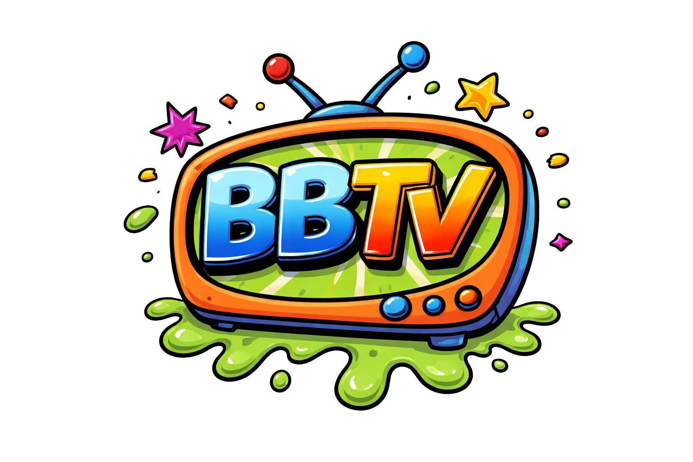

<p align="center">
  
</p>

<h1 align="center">BBTV</h1>

<p align="center">
  A QR code media player for kids. Scan a code from a printed book, watch a video on the TV.
</p>

---

BBTV lets your kids pick what to watch by scanning QR codes from a physical picture book. A USB barcode scanner reads the code, and VLC plays the video fullscreen on your TV. You control the library, the time limits, and print the books.

## How It Works

1. You organize your local media files (movies, TV shows, music videos)
2. BBTV scans them, fetches cover art from TMDB, and generates QR codes
3. You print a picture book: cover art + QR code for each title
4. Your kid flips through the book, finds something they want to watch, and scans the QR code
5. VLC launches fullscreen and plays the video

## Features

- **QR code playback** — USB HID barcode scanner triggers VLC fullscreen
- **Plex-style library** — scans folder structures like `TV Shows/Show Name/Season 01/Episode 01.mp4`
- **TMDB metadata** — auto-fetches cover art, episode titles, and descriptions
- **Printable QR code books** — grid layouts with cover art, organized by category, print-friendly CSS
- **Resume playback** — stops mid-episode? Scanning again picks up where they left off
- **Multi-child accounts** — each kid gets a sign-in QR code with individual time tracking
- **Day-of-week schedules** — different allotments for weekdays vs weekends
- **Bonus time** — reward extra screen time for chores (persists until spent, capped by daily max)
- **Special QR codes** — play/resume, pause, stop, next/skip, random, sign out
- **YouTube downloads** — paste a URL in the admin UI, download via yt-dlp
- **TV static idle screen** — CRT scanlines and animated noise while waiting for a scan
- **Cross-platform** — macOS and Linux (tested on Mac Mini and Omarchy)

## Requirements

- [Bun](https://bun.sh) runtime
- [VLC](https://www.videolan.org/) media player
- A USB HID barcode/QR code scanner (e.g., [Netumscan](https://www.amazon.com/dp/B088QV215Y))
- Chrome or Chromium (for kiosk mode idle screen)
- [yt-dlp](https://github.com/yt-dlp/yt-dlp) (optional, for YouTube downloads)
- [TMDB API key](https://www.themoviedb.org/settings/api) (optional, free, for cover art)

## Quick Start

```bash
# Clone and install
git clone <repo-url> bbtv
cd bbtv
bun install

# Configure
export BBTV_MEDIA_DIRS="/path/to/your/media"
export TMDB_API_KEY="your-tmdb-api-key"  # optional

# Start
bun run start
```

This starts the server on port 3456 and opens a kiosk browser on the idle screen.

- **Idle screen (TV):** http://localhost:3456/idle
- **Admin UI (your phone/laptop):** http://localhost:3456/admin

## Media Directory Structure

Organize your files like this:

```
/media/
  TV Shows/
    Blues Clues/
      Season 01/
        Episode 01 - Snack Time.mp4
        Episode 02 - What Time Is It.mp4
    Bluey/
      01 - Magic Xylophone.mp4
      02 - Hospital.mp4
  Movies/
    Toy Story (1995).mp4
    Finding Nemo/
      Finding Nemo.mp4
  Music Videos/
    Baby Shark.mp4
```

Shows can have seasons or be flat. Movies can be standalone files or in folders.

## CLI Commands

```bash
bun run start    # Start server + kiosk browser
bun run scan     # Scan media directories
bun run match    # Fetch TMDB metadata for unmatched items
```

## Admin UI

Access from any device on your network at `http://<server-ip>:3456/admin`.

| Page | What it does |
|------|-------------|
| **Dashboard** | Library stats, scan/match buttons |
| **Library** | Browse media, view metadata, TMDB matching |
| **Children** | Add kids, set schedules, grant bonus time |
| **Download** | Download YouTube videos via yt-dlp |
| **Print Book** | Generate printable QR code pages with cover art |
| **Settings** | Time limits, special QR codes, server config |

## Children & Time Limits

When children are configured:

1. The idle screen shows "Scan your name card to start!"
2. Child scans their personal QR code to sign in
3. They scan media QR codes to watch — time is tracked per child
4. When their time is up, playback is blocked with a friendly message

Each child has a **weekly schedule**:

| Setting | Description |
|---------|-------------|
| **Allotment** | Free daily minutes (e.g., 30 min on weekdays) |
| **Maximum** | Cap including bonus time (e.g., 60 min on weekdays) |

**Bonus time** can be granted for chores/good behavior. It persists until spent but is always capped by the daily maximum.

Example: Monday has 30 min allotment, 60 min max. A child with 20 bonus minutes can watch 50 min total (30 + 20). A child with 100 bonus minutes can still only watch 60 min (the max).

## Special QR Codes

Print these from the Settings page and add them to the book:

| Code | Action |
|------|--------|
| **Play / Resume** | Resume paused playback |
| **Pause** | Pause current video |
| **Stop** | Stop and return to idle screen |
| **Next / Skip** | Skip to the next episode |
| **Random** | Play something random |
| **Sign Out** | Sign out current child |

## Environment Variables

| Variable | Default | Description |
|----------|---------|-------------|
| `BBTV_PORT` | `3456` | Server port |
| `BBTV_MEDIA_DIRS` | — | Colon-separated media directory paths |
| `BBTV_DATA_DIR` | `./data` | Database and cover art storage |
| `TMDB_API_KEY` | — | TMDB API key for metadata |
| `YTDLP_PATH` | `yt-dlp` | Path to yt-dlp binary |

## Tech Stack

- **Runtime:** [Bun](https://bun.sh)
- **Server:** [Hono](https://hono.dev)
- **Database:** SQLite via `bun:sqlite`
- **Playback:** VLC (subprocess)
- **QR codes:** `qrcode` npm package (SVG)
- **Metadata:** TMDB v3 API
- **Downloads:** yt-dlp

## License

MIT
